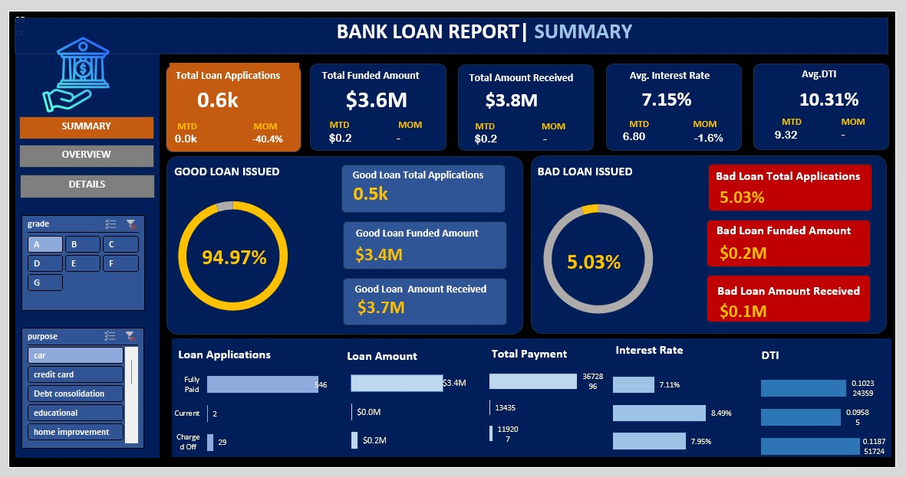

# 📊 Bank Loan Analysis Dashboard (Excel)

This project is an **Excel-based Bank Loan Analysis Dashboard** that visualizes loan applications, funded and received amounts, and key performance metrics. It helps track trends by **month, state, employment length, and loan purpose**, with important KPIs like **interest rate** and **debt-to-income ratio (DTI)**. The dashboard is built using **Pivot Tables, slicers, and charts** for interactive data analysis and clear reporting.

---

## 📷 Screenshots

### 🔸 Summary Dashboard

### 🔸 Data Table

### 🔸 Overview Dashboard

---

## 🔑 Key Features

- Total Loan Applications, Funded & Received Amounts
- Good vs Bad Loan Issued Ratio
- Loan Application Trends by Month & State
- Purpose, Term & Employment Length Analysis
- Avg. Interest Rate & DTI KPIs
- Interactive Slicers for filtering data
- Summary Dashboard & Overview Dashboard in Excel

---

## 📂 Data Columns

- `loan_status`: Fully Paid / Charged Off
- `purpose`: Car, Credit Card, Home Improvement, etc.
- `annual_income`, `installment`, `interest_rate`, `dti`
- `address_state`, `home_ownership`, `emp_length`
- `issue_date`, `last_payment_date`, `last_credit_pull_date`

---

## 🛠 Tools Used

- Microsoft Excel
- Pivot Tables
- Slicers & Filters
- Donut, Bar, Line, and Map Charts
- Conditional Formatting
- Dashboard Layout Design

---

## 📈 Key Learnings

- Excel dashboard building & data storytelling
- Financial metric analysis in the banking domain
- Automating data insights using Pivot Tables and Slicers
- KPI design and visualization best practices

---

## 🚀 Future Improvements

- Automate data refresh with Power Query
- Add predictive analysis (loan default trends)
- Export dashboard to Power BI for richer visuals
- Build additional KPI scorecards

---

## 🙌 Author

Sakshi Dasaram Padole

---
